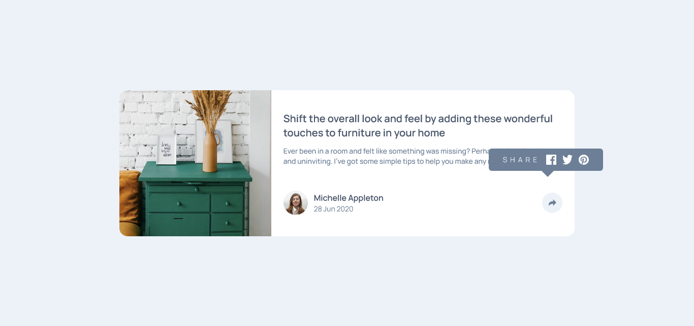

# Frontend Mentor - Article preview component solution

This is a solution to the [Article preview component challenge on Frontend Mentor](https://www.frontendmentor.io/challenges/article-preview-component-dYBN_pYFT). Frontend Mentor challenges help you improve your coding skills by building realistic projects.

## Table of contents

- [Overview](#overview)
  - [The challenge](#the-challenge)
  - [Screenshot](#screenshot)
  - [Links](#links)
  - [Built with](#built-with)
  - [What I learned](#what-i-learned)
- [Author](#author)

## Overview

### The challenge

Users should be able to:

- View the optimal layout for the component depending on their device's screen size
- See the social media share links when they click the share icon

### Screenshot



### Links

- Solution URL: [github](https://github.com)

### Built with

- Semantic HTML5 markup
- Tailwind
- Flexbox
- Mobile-first workflow
- [React](https://reactjs.org/) - JS library
- [Typescript](https://www.typescriptlang.org/) - extends JavaScript by adding types to the language.

### What I learned

Use this section to recap over some of your major learnings while working through this project. Writing these out and providing code samples of areas you want to highlight is a great way to reinforce your own knowledge.

To see how you can add code snippets, see below:

```js
function Article() {
  const [toggleShare, setToggleShare] = useState(false);

  function handleToggle() {
    setToggleShare((prev) => !prev);
  }

  return (
    <section className="rounded-2xl   max-w-4xl mx-auto bg-white flex flex-col relative lg:flex-row">
      <Image />
      <div className="p-6 flex flex-col lg:basis-2/3 lg:justify-center">
        <div className="flex flex-col gap-3 mb-12">
          <h1 className="text-xl font-semibold text-darkBlue ">
            Shift the overall look and feel by adding these wonderful touches to
            furniture in your home
          </h1>
          <p className="text-sm text-desaturatedBlue font-medium">
            {" "}
            Ever been in a room and felt like something was missing? Perhaps it felt
            slightly bare and uninviting. I’ve got some simple tips to help you make
            any room feel complete.{" "}
          </p>
        </div>
        <div className="flex justify-between gap-3 items-center">
          <div className="flex gap-3 items-center">
            
            <div>
              <h3 className="text-base font-semibold text-darkBlue ">
                Michelle Appleton{" "}
              </h3>
              <p className="text-sm text-desaturatedBlue  ">28 Jun 2020</p>
            </div>
          </div>
          <div
            onClick={handleToggle}
            className="w-10 h-10 rounded-full flex justify-center items-center z-40 relative bg-lightBlue"
          >
            
          </div>
        </div>
      </div>
      {toggleShare && <Share />}
    </section>
  );
}
```

## Author

- Frontend Mentor - [@oloude](https://www.frontendmentor.io/profile/oloude)
- Twitter - [@AbosedeOloude](https://www.twitter.com/AbosedeOloude)
